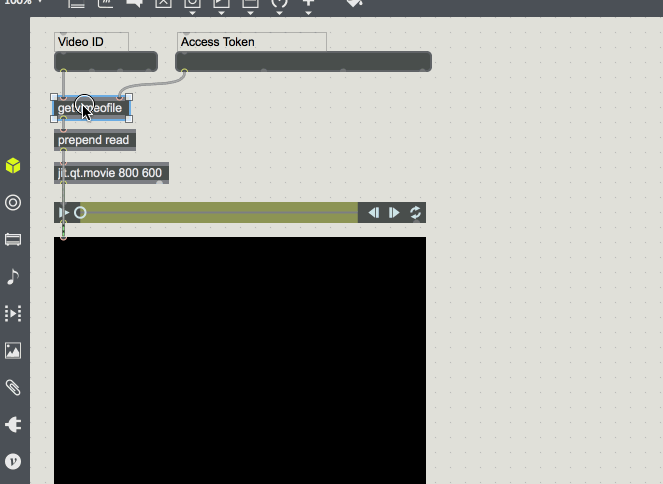
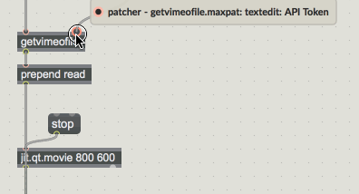
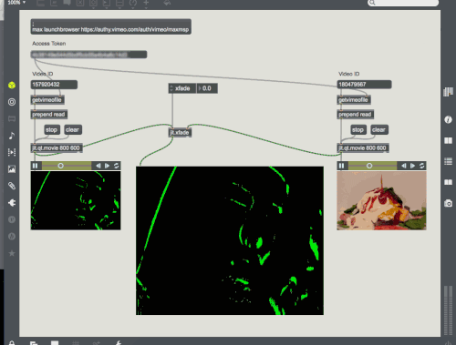

# VimeoMaxAPI
API to play and manipulate Vimeo videos on Max/MSP and Jitter.  
The `getvimeofile` object is a limited API to access your Vimeo videos via Max/MSP. The object outputs a link which can then be used with `read` and `jit.qt.movie` like any other input video on jitter.  
This API currently supports only progressive video playback and picks the resolution at random.

## Requirements
- Max 7 or higher
- QuickTime
- Developer credentials to your Vimeo account

## Installation

Download the latest release and copy the max-vimeo folder into the Max 7 Packages directory.  
Mac OS path: `~/Users/Documents/Max`  
Windows path: `C:\ProgramData\Max 7\Packages`  

The `getvimeofile` object should be available in your Max search path the next time you run it.  

> The `getvimeofile` requires video file access via the Vimeo API. Accessing video files is limited to [Vimeo Pro and Business](https://vimeo.com/upgrade) customers. 

> You can only stream videos from your own Vimeo account. Access to all videos is limited to partnership-level integrations. If you are interested in a partnership, reach out to casey@vimeo.com

## Usage

Vimeo Max/MSP API is encapsulated an object called `getvimeofile`.  
This object takes in the ID of your video on Vimeo, and an API token. [Click Here](https://authy.vimeo.com/auth/vimeo/maxmsp) to generate an API token for your Max/MSP patch.  
The help page contains an example player patch that should get you started.  

  

Here's a gif of a quick'n'dirty patch mixing two Vimeo videos using a A/B Deck structure. The patcher is available in the `/examples` directory

